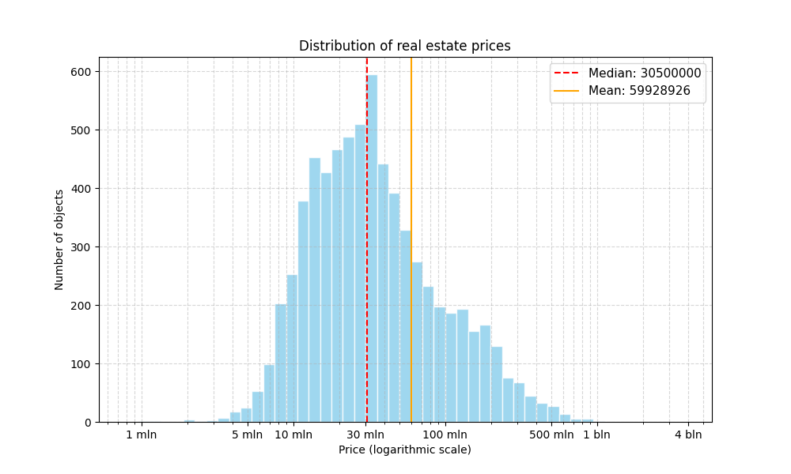
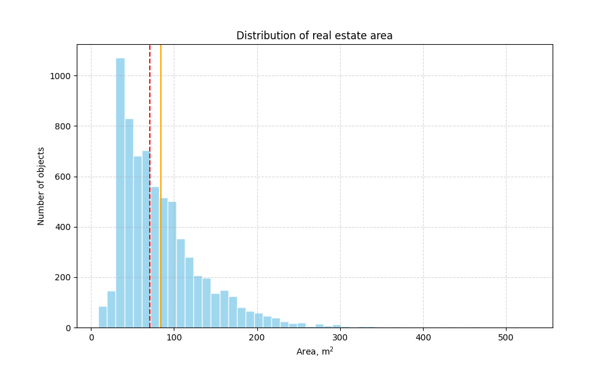
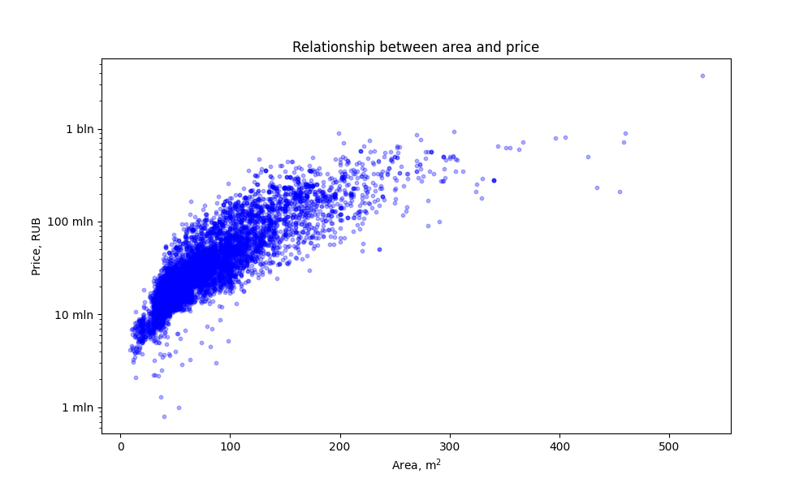
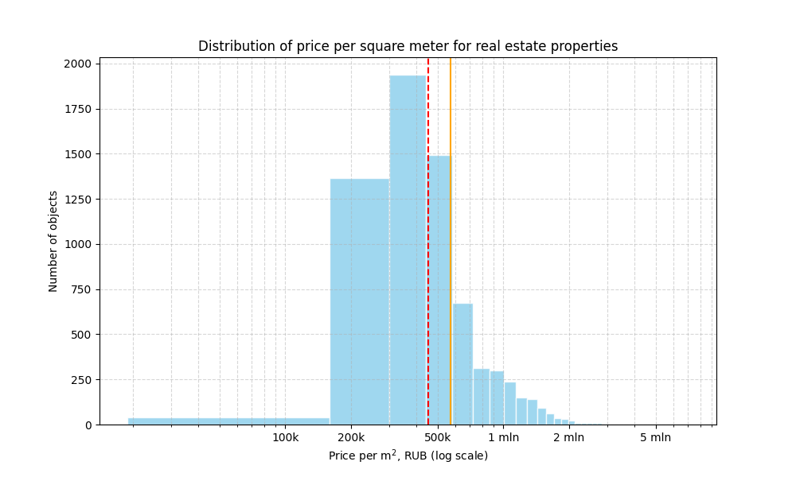
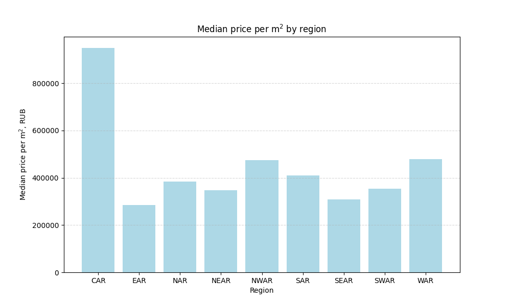

# Moscow Real Estate Analysis

## About the project

Exploratory data analysis of the Moscow real estate market based on a dataset of more than 6,900 property listings. 
The project investigates price distribution, the relationship between area and price, price per square meter, and differences between administrative regions of Moscow.

## Dataset

The dataset contains information about properties in Moscow, including:

* price — price of the property in rubles
* total_area — total floor area, m²
* living_area — living area, m²
* floor — floor number
* number_of_floors — number of floors in the building
* construction_year — year of construction
* ceiling_height — ceiling height, m
* number_of_rooms — number of rooms
* min_to_metro — minutes to the nearest metro station
* region_of_moscow — administrative region (CAR, WAR, NWAR, SAR, NAR, NEAR, SEAR, SWAR, EAR)
* is_new — new building indicator
* is_apartments — apartments indicator

Missing values are present in several columns (living_area — 35.4%, ceiling_height — 27.6%, construction_year — 17.5%), but they are not critical for the main analysis.

## Data preprocessing

The following steps were performed:
1. Removed duplicate rows (3 duplicates found)
2. Filled missing values in ceiling_height with the median
3. Removed rows with missing number_of_floors
4. Removed physically impossible values:
	* total_area ≤ 0
	* price ≤ 0
	* number_of_rooms < 0
	* floor > number_of_floors
	* floor ≤ 0
	* number_of_floors ≤ 0
	* ceiling_height ≤ 0

The original dataset contained 7,000 rows. After removing duplicates, rows with missing number_of_floors, and physically impossible values, 6,960 rows remained (40 rows removed, ~0.6% of the data).

## Analysis

### 1. Price distribution

* Median price: 30,500,000 RUB
* Mean price: 59,910,861 RUB
* Standard deviation: 93,538,800 RUB
* Minimum: 800,000 RUB
* Maximum: 3,737,636,000 RUB
* Interquartile range (25%–75%): 16,500,000 – 63,000,000 RUB

The mean is almost twice the median, which indicates a right-skewed distribution with a long tail of expensive properties. The typical price range is 16.5–63 million RUB.

### 2. Area distribution

* Median area: 70.85 m²
* Mean area: 84.14 m²
* Minimum: 9 m²
* Maximum: 530 m²

The mean area (84.14 m²) is higher than the median (70.85 m²), indicating a right-skewed distribution.

### 3. Area and price relationship

* Correlation between area and price: 0.75 (strong positive)

There is a clear positive relationship between area and price. However, the spread of prices increases with area, and there are several outliers with unusual price-to-area ratios.

### 4. Price per square meter

* Median price per m²: approximately 400,000 RUB
* Mean price per m² is higher than the median, indicating a right-skewed distribution

A large share of properties is concentrated in the range of 200,000–500,000 RUB per m².

### 5. Price per square meter by region

| Region | Count | Median price, RUB | Median price per m², RUB |
|--------|-------|-------------------|--------------------------|
| CAR (Central) | 1,662 | 109,213,650 | 949,276 |
| WAR (Western) | 1,261 | 34,800,000 | 478,571 |
| NWAR (North-Western) | 724 | 28,800,000 | 475,192 |
| SAR (Southern) | 698 | 23,003,353 | 409,237 |
| NAR (Northern) | 655 | 23,700,000 | 383,882 |
| NEAR (North-Eastern) | 543 | 20,800,000 | 347,222 |
| SEAR (South-Eastern) | 502 | 15,975,000 | 308,650 |
| SWAR (South-Western) | 467 | 24,000,000 | 353,897 |
| EAR (Eastern) | 376 | 13,000,000 | 285,613 |

The Central Administrative Region has the highest median price per m² (949,276 RUB), almost twice the value of the next highest region, WAR (478,571 RUB). The Eastern region has the lowest median price per m² (285,613 RUB).

## Key findings

1. The median property price in Moscow is 30.5 million RUB, while the mean is 59.9 million RUB — almost twice as high. This indicates a strong right-skewed distribution with a small number of very expensive properties.
2. The correlation between area and price is 0.75 — a strong positive relationship. Larger properties tend to be more expensive, but the spread of prices grows with area.
3. The median price per square meter varies significantly between administrative regions — from 285,613 RUB in the Eastern district to 949,276 RUB in the Central district, a difference of 3.3x. The median price per m² in the Central region is more than twice that of the next highest region (WAR).
4. The rankings by median total price and median price per m² are broadly similar. Further analysis would be needed to separate the effects of property size and price per m² on regional price differences.

## Technologies

* Python 3.10+
* pandas — data loading and preprocessing
* NumPy — numerical operations
* Matplotlib — visualization
